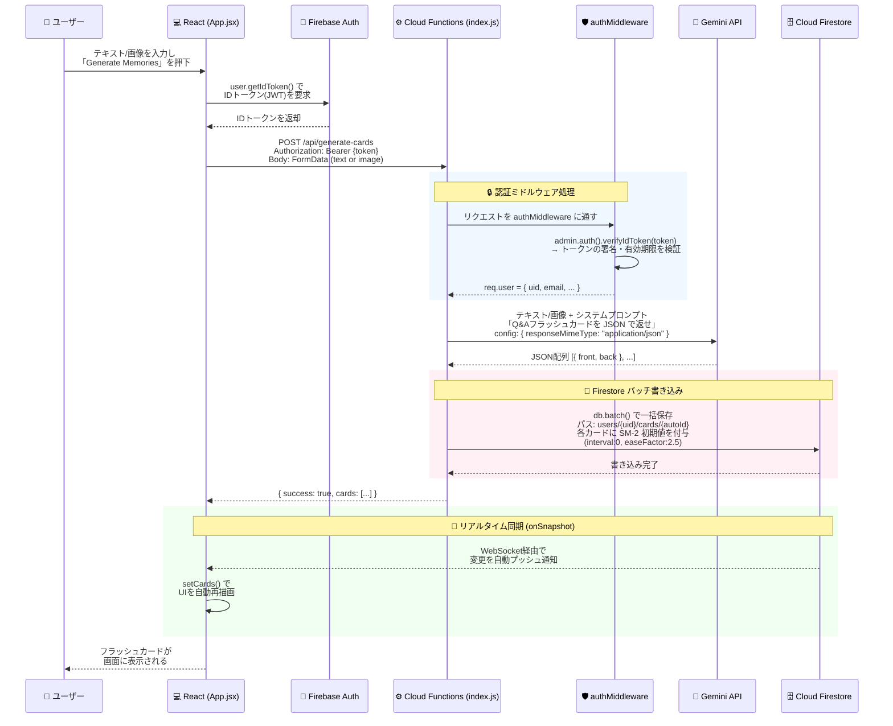
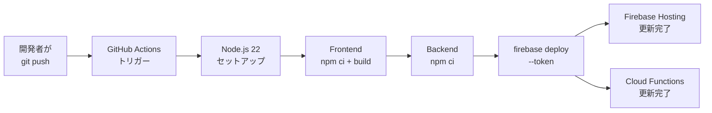

# Memory Glass — システムアーキテクチャ詳細

本ドキュメントでは、Memory Glass の設計思想からデータフロー、セキュリティ、インフラ構成に至るまで、システム全体のアーキテクチャを詳細に解説します。

---

## 1. アーキテクチャ概観

Memory Glass は **3層アーキテクチャ（プレゼンテーション層 / ビジネスロジック層 / データ層）** を採用した、フルスタック・ウェブアプリケーションです。

```
┌─────────────────────────────────────────────────────────────────────┐
│                        ユーザー（ブラウザ）                          │
└───────────────────────────────┬──────────────────────────────────────┘
                                │ HTTPS
┌───────────────────────────────▼──────────────────────────────────────┐
│ 【プレゼンテーション層】  Firebase Hosting (グローバルCDN)            │
│   React + Vite / Glassmorphism CSS                                  │
│   Firebase Auth SDK (Google OAuth)                                  │
│   Firestore Client SDK (onSnapshot リアルタイム同期)                 │
└───────────────────────────────┬──────────────────────────────────────┘
                                │ REST API (Bearer Token 認証)
┌───────────────────────────────▼──────────────────────────────────────┐
│ 【ビジネスロジック層】  Cloud Functions for Firebase v2 (Cloud Run)   │
│   Node.js 22 + Express                                              │
│   authMiddleware (IDトークン検証)                                    │
│   Gemini API (@google/genai) — gemini-3.1-pro-preview               │
│   Firebase Admin SDK (Firestore への特権書き込み)                    │
└───────────────┬────────────────────────────┬─────────────────────────┘
                │                            │
┌───────────────▼───────┐   ┌────────────────▼─────────────────────────┐
│ 【データ層】           │   │ 【外部サービス】                          │
│  Cloud Firestore      │   │  Google Gemini API                       │
│  (NoSQL DB)           │   │  GCP Secret Manager                      │
│  Firestore Rules      │   │  Firebase Authentication                 │
└───────────────────────┘   └──────────────────────────────────────────┘
```

---

## 2. 使用している GCP / Firebase サービス一覧

| サービス名 | 役割 | 本プロジェクトでの用途 |
|---|---|---|
| **Firebase Hosting** | 静的ファイル配信（CDN） | React ビルド成果物（HTML/CSS/JS）をグローバルに配信 |
| **Cloud Functions for Firebase v2** | サーバーレスAPI実行環境 | Express アプリの実行。内部的に GCP Cloud Run コンテナが起動 |
| **Cloud Firestore** | NoSQL ドキュメントDB | ユーザーごとのフラッシュカードデータの永続化・リアルタイム同期 |
| **Firebase Authentication** | ユーザー認証基盤 | Google OAuth 2.0 によるログイン。IDトークン (JWT) の発行・検証 |
| **GCP Secret Manager** | シークレット管理 | Gemini API キーの暗号化保管。Cloud Functions の `secrets` オプションで自動注入 |
| **Cloud Run** | コンテナ実行環境 | Cloud Functions v2 の実行基盤として自動的に使用される |
| **Artifact Registry** | コンテナイメージ保管 | Cloud Functions デプロイ時にビルドされたコンテナイメージを保管 |

---

## 3. データフロー詳細

### 3.1 フラッシュカード生成フロー

ユーザーが「Generate Memories」ボタンを押してから、カードが表示されるまでの一連の処理を、コードの実装に基づいて詳細に説明します。



#### 各ステップの実装詳細

| ステップ | 担当ファイル | 処理内容 |
|---|---|---|
| ① IDトークン取得 | `App.jsx` L73 | `user.getIdToken()` で Firebase Auth SDK が JWT を発行 |
| ② APIリクエスト送信 | `App.jsx` L82-88 | `fetch()` で Cloud Functions の `/api/generate-cards` に FormData を POST |
| ③ トークン検証 | `authMiddleware.js` | `Authorization` ヘッダーから Bearer トークンを抽出し `admin.auth().verifyIdToken()` で検証。不正なら 401/403 を返却 |
| ④ AI解析 | `geminiService.js` | Gemini API に `responseMimeType: "application/json"` を指定し、構造化された JSON を直接取得 |
| ⑤ DB保存 | `index.js` L50-69 | `db.batch()` を使い、生成されたカード群を **1回のトランザクション** で Firestore に一括書き込み。SM-2 の初期パラメータ（`interval: 0`, `easeFactor: 2.5`）も同時に設定 |
| ⑥ リアルタイム同期 | `App.jsx` L38-46 | Firestore の `onSnapshot()` リスナーがDB変更を検知し、UIが自動的に再描画される（画面リロード不要） |

### 3.2 間隔反復（Spaced Repetition）フロー

ユーザーがフラッシュカードの「Good」「Easy」などのボタンを押した時は、**フロントエンドから直接 Firestore を更新** します（バックエンドを経由しません）。

```
ユーザーが「Good」を押下
  → Flashcard.jsx 内で SM-2 アルゴリズムを計算
  → updateDoc() で Firestore の該当カードを直接更新
    - interval: 1 → 6 → 15 → ... (日数が指数的に増加)
    - easeFactor: 難易度に応じて 1.3〜2.5 の範囲で調整
    - nextReviewDate: interval 日後の日時を設定
  → onSnapshot が変更を検知し、DBビューアもリアルタイム更新
```

> **なぜカード生成はバックエンド経由で、復習はフロントエンドから直接なのか？**
> - カード生成時は **Gemini API キー** が必要なため、キーを隠蔽できるバックエンドで処理する必要がある
> - 復習時は既存データの数値更新のみで秘密情報が不要。Firestore Security Rules が「自分のデータだけ更新可能」と保証しているため、直接更新で安全かつ高速

### 3.3 AIチャットアシスタントフロー

「About this App」ページやDBビューアに組み込まれた AIチャット機能は、会話履歴を含めてバックエンドに送信することで、文脈を保持した対話を実現しています。

```
ユーザーが質問を入力
  → AiChat.jsx が会話履歴全体を POST /api/chat に送信
  → chatService.js が Gemini API に systemInstruction 付きで転送
    - systemInstruction: Memory Glass の技術詳細を含むプロンプト
    - contents: ユーザーとモデルの会話履歴
  → Gemini が文脈を理解した日本語の回答を生成
  → フロントエンドのチャットUIに表示
```

---

## 4. セキュリティアーキテクチャ

本プロジェクトでは、**多層防御（Defense in Depth）** の考え方に基づき、複数の独立したセキュリティレイヤーを組み合わせています。

### 4.1 認証レイヤー（Firebase Authentication）

```
ユーザー → Google OAuth 2.0 → Firebase Auth → IDトークン (JWT) 発行
```
- Firebase Authentication が Google の OAuth 2.0 フローを管理
- 認証成功後、Firebase が署名付き **IDトークン (JSON Web Token)** を発行
- このトークンにはユーザーの `uid`, `email`, トークンの有効期限などが暗号化されて含まれる

### 4.2 API保護レイヤー（authMiddleware）

```javascript
// authMiddleware.js — すべてのAPIリクエストに適用
const decodedToken = await admin.auth().verifyIdToken(idToken);
req.user = decodedToken; // uid, email 等をリクエストオブジェクトに注入
```
- `Authorization: Bearer <token>` ヘッダーからトークンを抽出
- Firebase Admin SDK の `verifyIdToken()` で **署名の正当性**・**有効期限**・**発行元** を検証
- 検証に失敗した場合は即座に `401 Unauthorized` または `403 Forbidden` を返却

### 4.3 データベース保護レイヤー（Firestore Security Rules）

```
// firestore.rules
match /users/{userId}/{document=**} {
  allow read, write: if request.auth != null && request.auth.uid == userId;
}
```
- フロントエンドから Firestore Client SDK で直接操作する際のアクセス制御
- **「ログインしているユーザーの UID」と「アクセス先ドキュメントパスの UID」が完全に一致** しない限り、読み書きを拒否
- バックエンドからの書き込みは Firebase Admin SDK（特権モード）を使用するため、このルールをバイパスする

### 4.4 シークレット管理レイヤー（GCP Secret Manager）

```javascript
// index.js — Cloud Functions v2 の設定
exports.api = onRequest({
  region: "asia-northeast1",
  secrets: ["GEMINI_API_KEY"]  // Secret Manager から自動注入
}, app);
```
- Gemini API キーはソースコードやリポジトリに一切含まれない
- GCP Secret Manager に暗号化されて保管され、Cloud Functions 起動時に環境変数として自動的に注入される
- ローカル開発時は `.env` ファイルを使用（`.gitignore` で Git 管理から除外）

### 4.5 通信保護レイヤー（CORS）

```javascript
// index.js — 許可するオリジンを明示的に制限
const allowedOrigins = [
  'http://localhost:5173',                    // ローカル開発
  'https://memory-glass-2026.web.app',        // 本番 (Firebase Hosting)
  'https://memory-glass-2026.firebaseapp.com' // 本番 (代替ドメイン)
];
```
- ブラウザの Same-Origin Policy を補完する CORS（Cross-Origin Resource Sharing）設定
- 上記ホワイトリストに含まれないドメインからの API リクエストはすべてブロックされる

---

## 5. Firestore データモデル

```
Cloud Firestore (memory-glass-2026)
│
└── users (コレクション)
     │
     └── {userId} (ドキュメント — Firebase Auth の UID)
          │
          └── cards (サブコレクション)
               │
               └── {cardId} (ドキュメント — 自動生成ID)
                    │
                    ├── front: string              # 質問文
                    ├── back: string               # 解答文
                    ├── createdAt: Timestamp        # 作成日時
                    ├── interval: number            # 復習間隔（日数）
                    │                                 初期値: 0
                    ├── repetitions: number         # 連続正答回数
                    │                                 初期値: 0
                    ├── easeFactor: number           # SM-2 難易度係数
                    │                                 初期値: 2.5（標準）
                    │                                 範囲: 1.3〜2.5
                    └── nextReviewDate: Timestamp    # 次回復習予定日時
                                                      初期値: 作成日（即時復習）
```

- **ユーザー分離**: 各ユーザーのデータは `users/{uid}` 配下に完全に分離されている
- **スケーラビリティ**: Firestore はコレクション内のドキュメント数に制限がなく、ユーザー数やカード数が増加しても性能が劣化しない
- **リアルタイムリスナー**: フロントエンドは `users/{uid}/cards` コレクションに `onSnapshot` リスナーを設置し、変更を即座に受信

---

## 6. CI/CD パイプライン（GitHub Actions）



| ステップ | 処理内容 |
|---|---|
| トリガー | `main` ブランチへの `push` イベント |
| ビルド | `frontend/` 内で `npm ci` + `npm run build` を実行し、最適化された静的ファイルを `dist/` に生成 |
| デプロイ | `firebase deploy --token` で Hosting と Functions を同時にデプロイ |
| 認証 | GitHub Secrets に登録された `FIREBASE_TOKEN` を使用（`firebase login:ci` で発行） |

---

## 7. ローカル開発環境 vs 本番環境の比較

| 項目 | ローカル開発 | 本番環境 |
|---|---|---|
| フロントエンド | `localhost:5173` (Vite dev server) | Firebase Hosting CDN (`memory-glass-2026.web.app`) |
| バックエンド | `localhost:3000` (Node.js 直接実行) | Cloud Functions v2 / Cloud Run (asia-northeast1) |
| APIキー管理 | `.env` ファイル | GCP Secret Manager |
| CORS | `localhost:5173` を許可 | 本番ドメインのみ許可 |
| Firestore | 本番DBに直接接続 | 同一（本番DB） |
| デプロイ | 手動 (`node index.js`) | GitHub Actions で自動 |
